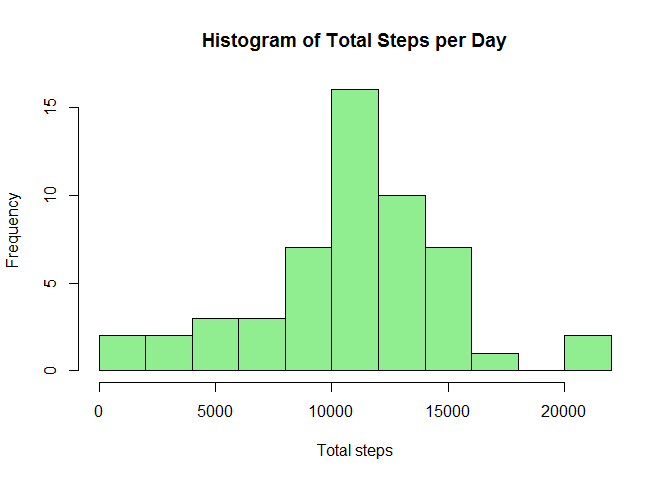
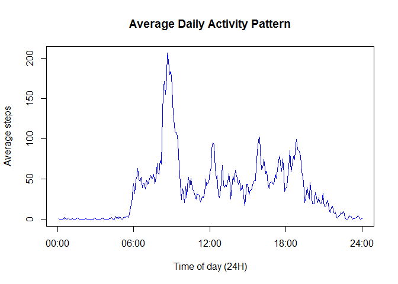
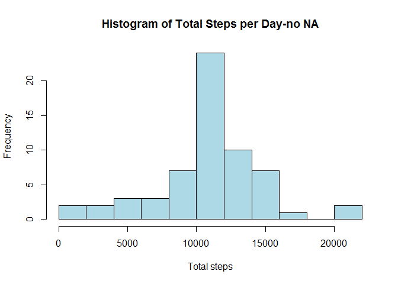
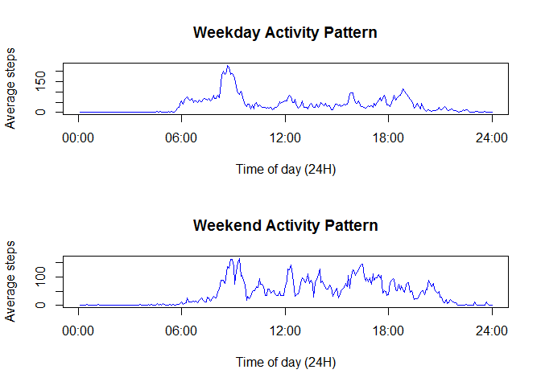

# Reproducible Research: Peer Assessment 1


## Loading and preprocessing the data
### note for reviewers
Since the initial file was zipped, I first extracted the "activity.csv" into the working folder.  It is possible to extract the file directly from the zip file using R. a code for that will look like this:

```r
temp <- tempfile()
download.file("file_url_here",temp)
data <- read.table(unz(temp, "A.dat"))
unlink(temp)
```
However, this can cause problems when running on different OS so in the sake of simplicity I decided to start working after the file has been unzipped into the working folder
    
I used the read.csv() function to read the file into the intial dataset (named Qdata)

```r
Qdata <- read.csv(file="activity.csv", header=TRUE, colClasses=c("integer","Date", "integer"))
```
Within read.csv(), i've used colClasses to define the variables type.


## What is mean total number of steps taken per day?
Since the instruction was to ignore the missing values, I decided to filter them out using the complete.cases() function.

I named the new data set Q1data:

```r
Q1data <- Qdata[complete.cases(Qdata),]
```
1.To calculate the total number of steps per day, I first split the data according to the date variable and afterwards I use sapply() to sum each part.
I than creat a Histogram of the total steps per day

```r
Q1data_sub <- split(Q1data, Q1data$date)
total_steps <- sapply(Q1data_sub, function (x) sum(x[,"steps"]))
hist(total_steps, main="Histogram of Total Steps per Day", xlab="Total steps", breaks=10,col="lightgreen")
```

 

Note- The wording of the question was a bit misleading.  One might think that a bar chart of total steps per day (y- axis) Vs days/dates (x- axis) is requested. Since the question stated "Histogram" specifically, a histogram and not a bar chart is presented here. 

2.to get the mean and median of the total number of steps, i use summary() on the total_steps variable:

```r
summary(total_steps)
```

```
##    Min. 1st Qu.  Median    Mean 3rd Qu.    Max. 
##      41    8841   10760   10770   13290   21190
```

From the table above, we get - mean = 10770, Median = 10760  

## What is the average daily activity pattern?
1.To calculate the average number of steps for an interval across all days, I first add to the table another column that "counts" the intervals.  Since there are 288 intervals within a day (12 intervals an hour timed 24 = 288), I can use this variable to split the data and average each part separately.  i again employ the split/sapply method.  

```r
Qdata$interval_id <- 1:288
Q2data_sub <- split (Qdata, Qdata$interval_id)
avg_steps_interval <- sapply(Q2data_sub, function(x) mean(x[,"steps"], na.rm=TRUE))
plot(1:288, avg_steps_interval, type="l", main ="Average Daily Activity Pattern", ylab="Average steps", xlab="Time of day (24H)", col="blue", xaxt="n")
axis(1, at=c(0,72,144,216,288), labels=c("00:00", "06:00", "12:00", "18:00", "24:00"))
```

 

2.To find the interval that, on average,  has the highest number of steps, I use which.max() 

```r
which.max(avg_steps_interval)
```

```
## 104 
## 104
```

Interval 104 (or 08:40 in normal time) has the highest number of steps.  

## Imputing missing values
1. o calculate the number of rows with NA, I again use complete.cases():

```r
sum(!complete.cases(Qdata))
```

```
## [1] 2304
```

so, 2304 rows have NA in them. that's around 13%.

2. My strategy for filling in the NA cells is to create a for loop that runs on every cell in the steps column and checks if it is Na (via is.na). 
If the cell is NA, I populate it with the average for that time interval, taken from the avg_steps_interval variable.
3.To keep the original data set intact, I first duplicate it to another data set named Qdata_noNA


```r
Qdata_noNA <- Qdata
for (i in 1:length(Qdata_noNA$steps)){
    if (is.na(Qdata_noNA$steps[i])) {
        Qdata_noNA$steps[i]=avg_steps_interval[Qdata_noNA$interval_id[i]]
    }
}
```
4. now that i have the revised data set with no NA values, i build a histogram following the same logic as before- splitting the data according to date and calculating the sum for each part.

```r
Qdata_noNA_sub <- split(Qdata_noNA, Qdata_noNA$date)
total_steps_noNA <- sapply(Qdata_noNA_sub, function (x) sum(x[,"steps"]))
hist(total_steps_noNA, main="Histogram of Total Steps per Day-no NA", xlab="Total steps", breaks=10,col="lightblue")
```

 

to find the new mean and median, i use summary()

```r
summary(total_steps_noNA)
```

```
##    Min. 1st Qu.  Median    Mean 3rd Qu.    Max. 
##      41    9819   10770   10770   12810   21190
```
from the table we see that:

- the mean did not change. this was to be expected since we replaced the NA values with the average values. 

- the median value increased and is now the same as the mean.  adding more values that are the same as the average will reduce variance and will contribute to the symmetry of the curve. in a symmetric curve, the mean, median (and mode) are the same.  

## Are there differences in activity patterns between weekdays and weekends?
1. for this part my strategy was to create an empty column, fill it with 1 and 0 according to the day (0- Weekdays, 1-Weekend) and then define that column as a factor with the appropriate levels.(the Sys.setlocale is used here so the days will be in english) 

```r
Qdata_noNA$day_id <- NA
Sys.setlocale("LC_TIME", "C")
```

```
## [1] "C"
```

```r
for (i in 1: length(Qdata_noNA$date)) {
    if (weekdays(Qdata_noNA$date[i])!= "Saturday"  && weekdays(Qdata_noNA$date[i])!= "Sunday"){
        Qdata_noNA$day_id[i]=0
    }
    else {Qdata_noNA$day_id[i]=1}
}
Qdata_noNA$day_id <- factor(Qdata_noNA$day_id, levels = c(0,1), labels = c("Weekday", "Weekend"))
```

2. In this part, I've used the same strategy as the previous questions.I subset the data into two tables- weekend and weekday and then split each one according to the interval_id. I then use sapply to calculate the mean for each interval in each group. I then use BASE plotting system to create the panel.

```r
Weekday_data <- Qdata_noNA[Qdata_noNA$day_id=="Weekday",]
Weekend_data <- Qdata_noNA[Qdata_noNA$day_id=="Weekend",]
Weekday_sub <- split (Weekday_data, Weekday_data$interval_id)
avg_steps_weekday <- sapply(Weekday_sub, function(x) mean(x[,"steps"]))
Weekend_sub <- split (Weekend_data, Weekend_data$interval_id)
avg_steps_weekend <- sapply(Weekend_sub, function(x) mean(x[,"steps"]))
par(mfrow=c(2,1))
plot(1:288, avg_steps_weekday, type="l", main ="Weekday Activity Pattern", ylab="Average steps", xlab="Time of day (24H)", col="blue", xaxt="n")
axis(1, at=c(0,72,144,216,288), labels=c("00:00", "06:00", "12:00", "18:00", "24:00"))
plot(1:288, avg_steps_weekend, type="l", main ="Weekend Activity Pattern", ylab="Average steps", xlab="Time of day (24H)", col="blue", xaxt="n")
axis(1, at=c(0,72,144,216,288), labels=c("00:00", "06:00", "12:00", "18:00", "24:00"))
```

 

